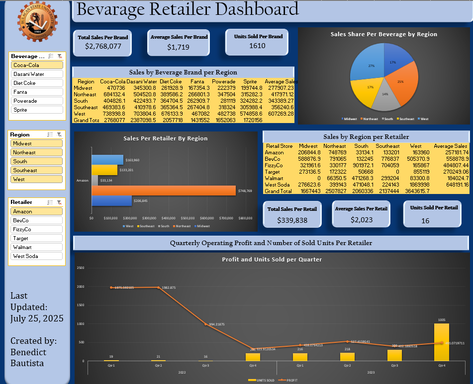

# 🧃 Beverage Sales Dashboard

This repository contains a Microsoft Excel dashboard that visualizes beverage sales data, including key performance indicators (KPIs), trends, and quarterly summaries. It is designed for data-driven business insights and reporting.

## 📊 Features

- Quarterly sales summary
- Items sold per category
- Profit visualization
- Interactive filters using slicers
- Clean and professional layout

## 📥 Download

Click the link below to download the Excel dashboard file:

[📥 Download Beverage Dashboard](https://github.com/wantap69/Beverage-Dashboard/raw/main/folder/bev_dashboard.xlsx)

> Note: File will automatically download or open in Excel depending on your browser settings.

## 🛠️ Tools Used

- Microsoft Excel
- Pivot Tables & Pivot Charts
- Slicers and filters
- Dashboard design best practices

## 📎 Preview

---

## 📬 Contact

For questions or collaboration, feel free to contact bendenabautista@gmail.com

